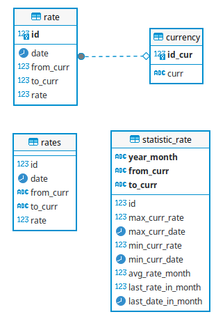

# Суть проекта
Получать данные о курсах валют 

Получить данные
- день, в который значение курса было максимальным,
- день, в который значение курса было минимальным,
- максимальное значение курса,
- минимальное значение курса,
- среднее значение курса за весь месяц,
- значение курса на последний день месяца.
  
https://exchangerate.host/documentation

# Запуск проекта
добавить в config.ini api key
## Локальный запуск
Для работы необходим python 3.10
1. Запустить БД docker compose up
2. Убедиться что в config.ini pg_hostname 0.0.0.0
3. Создать и активировать виртуальную среду
    - python3 -m venv venv
    - source venv/bin/activate
    - pip install -r requirements.txt
### Отключение
Для отключения виртуальной среды **deactivate**

## при помощи Docker
1. Убедиться что в config.ini pg_hostname host.docker.internal
1. docker build -t api .
2. docker compose up
3. docker run api == docker run api l BTC RUB

### Отключение
docker compose down

# Что можно сделать?
    - l загрузить текущий курс обмена 
      - из какого курса, 
      - в какой курс? (можно много курсов через запятую)
    - c загрузить курс за весь месяц
      - год (XXXX)
      - месяц (цифрой)
      - из какого курса, 
      - в какой курс? (можно много курсов через запятую)
    - a стат анализ 
      - из какого курса, 
      - в какой курс
      - дата с YYYY-MM-DD
      - дата по YYYY-MM-DD
## примеры запросов
    python3 exchangerate.py a BTC RUB 2000-07-15 2024-08-17
    python3 exchangerate.py a BTC RUB,USD,AUD,CAD,PLN,MXN 2000-07-15 2024-08-17
    python3 exchangerate.py c 2019 07 BTC RUB,USD,AUD,CAD,PLN,MXN
    python3 exchangerate.py c 2019 07 BTC RUB
    python3 exchangerate.py l BTC RUB

## Пример работы с функциями скрипта в контейнере
    docker run api l BTC RUB (по умолчанию при запуске)
    docker run api a BTC RUB 2000-07-15 2024-08-17
    docker run api c 2019 07 BTC RUB
    docker run api c 2019 07 BTC RUB,USD,AUD,CAD,PLN,MXN

# Описание решения
- курсы загружаются в staging таблицу rates из которой 
- с помощью триггера данные перераспределяются по таблицам rate и currency

- при сихранении статистических данных в таблицу **statistic_rate**. Cохранение происходит только для уникальных записей.  
Уникальность обеспечивается за счет полей **year_month, from_curr, to_curr**
- статистическая запись не может добавиться если месяц не закончился. CHECK (last_rate_in_month > 0)

